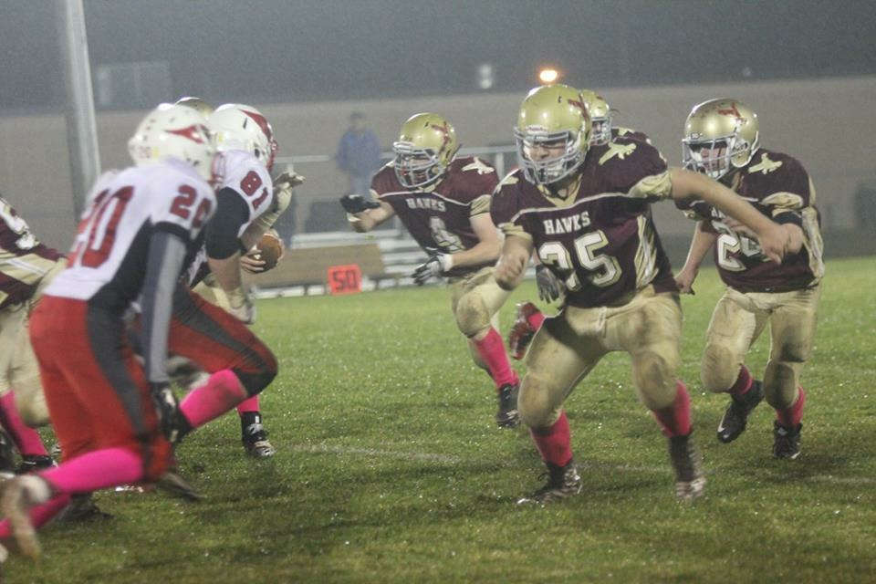

The Hawks finished up the 2015 football season with a win against the Thorp Cardinals at Rib Lake High School. On a rainy and windy night, the Hawks toughed it out for a 20-7 win over Thorp. For a season filled with close games, adversity, identity building and learning how to respond, it was a great way to finish the year. The identity of the football team will continue to grow because of the foundation built by the 2015 team. HAWKS PRIDE.