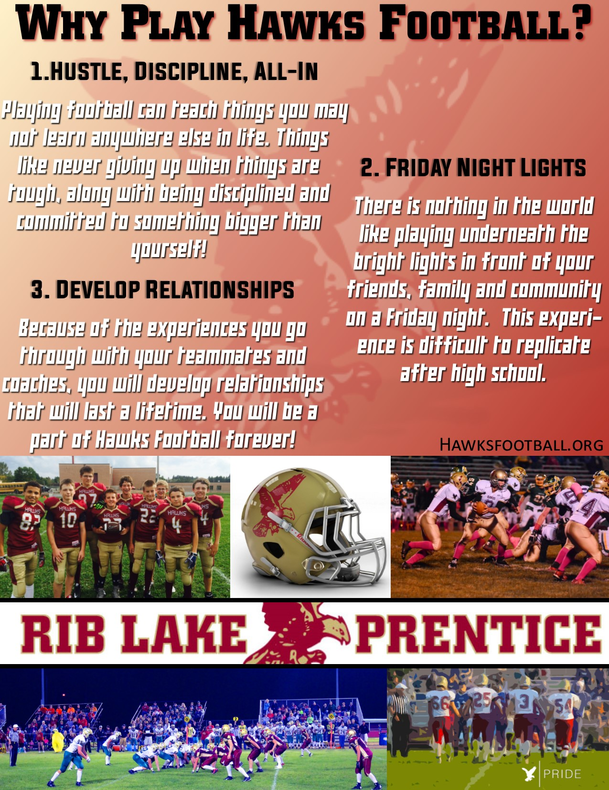

Hawks Football 2016

Playing football has a large number of benefits that cannot be achieved in any other areas of life. These benefits can last an entire lifetime. Be a part of something special in 2016 by joining, following or supporting the Rib Lake/Prentice Hawks Football team. “Hawks Pride” goes deeper than a saying on a T-shirt. It is not only a way to practice and play football, but a way to live your life! Looking forward to a great 2016!

The list of benefits goes on and on. Here’s a few more:

Brand new middle school authentic jerseys donated by the JJ Watt Foundation
Thursday night meals donated and served by the Touchdown Club
Improving physically, mentally and becoming a better teammate. Things that will help you regardless of your favorite sport or activity!
Stay tuned for more………..

Follow Hawks football on twitter @RLP_Hawks

Like the Touchdown Club on Facebook