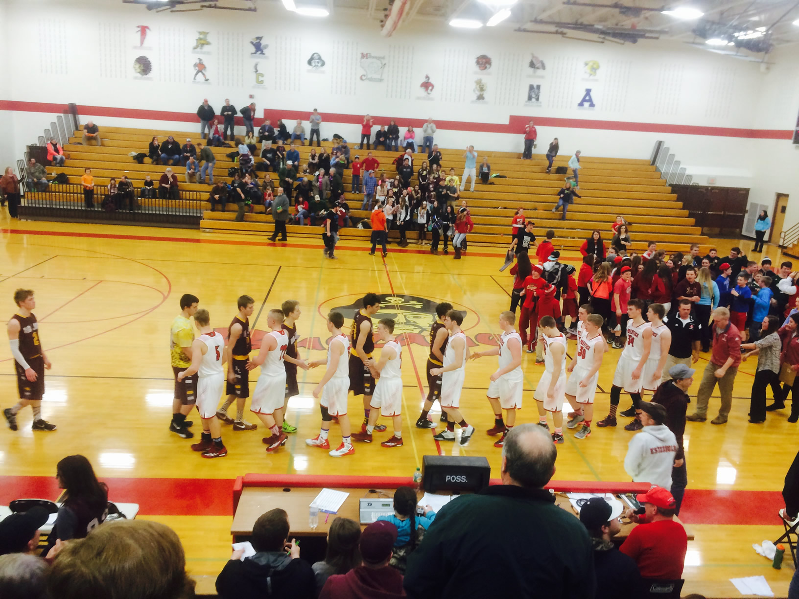

**Multi-sport athletes gain benefits that are more than just physical!**

The Rib Lake and Prentice basketball teams faced off for the second time this season this week. With each varsity and JV team splitting their games this season (with a possible playoff meeting coming), it is great to see Hawks players participating in multiple sports.

What are some benefits of being a multi-sport athlete?

* **Learn How to Play as a TEAM** - Playing as a team is important in almost all sports available at Rib Lake and Prentice. It’s also an important skill to have in the classroom and the workplace. By playing with different teammates, in a different atmosphere, students will learn important skills such as communication, discipline and teamwork. By going through the good times, and sometimes even more importantly, the tough times, student-athletes develop skills that not only help them in other sports, but in many other aspects of their lives.
* 
* **Limited Time Only!** - Playing high school sports is an opportunity available for a very limited time. Once graduated, most people find it difficult to simulate the same events, emotions and experiences high school sports provide. For high school student-athletes, this realization often comes when it is too late. Take advantage of your high school experience and be a part of something bigger than yourself!
* 
* **Being Coached by a Variety of Coaches** - By participating in different sports, athletes are able to be coached by and learn from a variety of coaches. These coaches may have different styles, philosophies and knowledge, all of which could benefit athletes in different ways. Take advantage of high school sports to learn from different coaches who can make you better in unique ways.

>These are only a few of the benefits of playing multiple sports at Rib Lake and Prentice. Make use of your time as a high school student by gaining experiences that can last a lifetime!