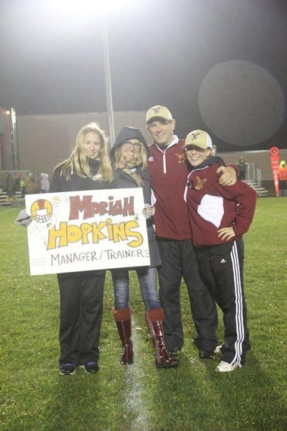

The following summary of the Hawks 2015 season was written by senior Manager/Trainer Moriah Hopkins. Moriah was a huge part of the team this season, making the lives of the players and coaches easier with all her help and hardwork:

My name is Moriah Hopkins and I am the manager and trainer of the Rib Lake/Prentice Hawks Football team. I started my freshman year and my responsibilities grew through my four years as a Rib Lake student. I am a senior this year, and am excited about going into athletic training in the future. The coaches and players were kind (and brave) enough to allow me to be involved with this aspect of the team, giving me a chance to serve and grow doing just what I love to do.

My job was to get the players’ equipment and bodies ready to play before practices and games. Practices included more managerial duties like running to get things the coaches/players needed, filming, organizing money and paperwork, and naming new plays for Coach K. Fridays, I taped ankles and such before games, and paced the sidelines ready to tape, ice, or stretch anyone running off the field with bloody battle wounds, bruises, or cramps.

The football season looks different through my eyes. The coaches and players are seeing blocks, routes, plays and strategies. I stand on the sidelines and look for limping, and guys not getting up after a hard hit. The game from my perspective probably looks a lot like the game from a concerned mother. I don’t really ever look at the score, I only care about injuries, potential problems, and team morale-no matter what the score.

My favorite part about being a manager/trainer for the hawks is all the quality players and coaches I get to work alongside. Last year, they were determined to get me to fully understand the game of football by the end of the year, and for the most part, they accomplished that. This year, they made it a priority for me to feel included in the team atmosphere. They were sensitive and caring, and that’s what made me feel a part of the team. There are many moments I wish I could have caught on film because these guys make me laugh. Strange, unpredictable situations happen every season, but that’s what keeps the season interesting, memorable and enjoyable!

Even though the scores of the games this past season did not reflect the true growth of the team from last year, it was evident in other ways. I felt like this year, the players had more confidence, character, and positive thinking than in the past. They were good guys to work with. We definitely lost many key seniors the year before, there were guys who decided to step up and fill those important roles. They really took to heart the “E+R=O” motto the coaches worked to instill this year- that you can’t control the situation, but you can and must learn to master your response to it, and in doing so effect the ultimate outcome. There were many events this season that were not preferable, but the response the team had to every situation made the outcome of a season that was fun to be a part of. The team depended on several underclassmen, and the juniors and seniors knew that. So instead of getting frustrated with our record, they took it on themselves to help the younger players grow so our program can continue to get better in the coming years. That takes character and selfless leadership!

The Rib Lake/Prentice Hawks have such an incredible future ahead of them. With the amazing coaching staff, there is no doubt this team is going to continue to improve from here on out. I am so excited to be able to come home from school in a couple years and see how much the Hawks have grown both on and off the field. The one thing I love best about this team is knowing that our reputation as a clean and honorable team will never change no matter what our skill level is. And it will make us good people long after high school football is a fond, faded memory.