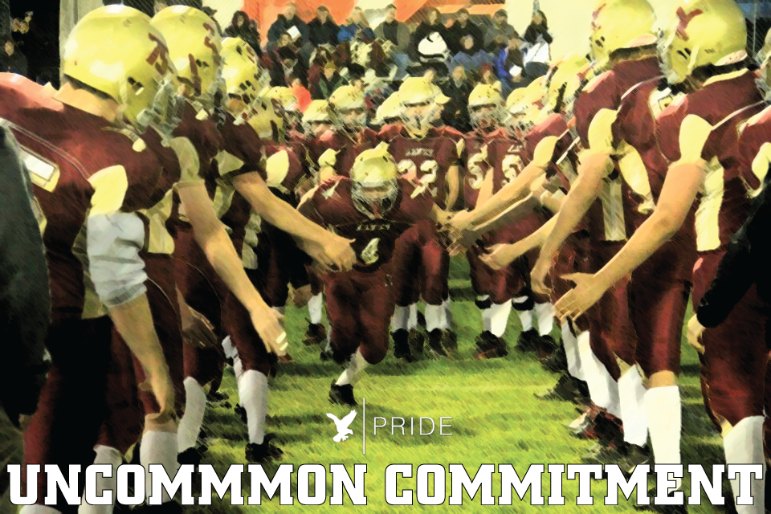
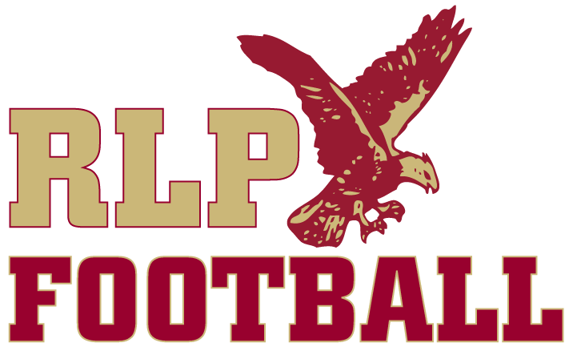

**Welcome to the new look official Hawks website.**

2016 is a brand new year of RLP Hawks football, with a variety of updates and improvements, and many things to look forward to, including 5 home games, and the 2nd annual Hawks Golf Outing.  That being said, the identity of RLP football remains the same: **HAWKS PRIDE**

The success of the 2016 Hawks will not be measured in wins and losses.  Their success will be measured in their _uncommon commitment_ to their teammates, playing as **ONE**, making **no excuses or explanations**, and giving their all for **"4-6 seconds, snap to whistle."** 

The primary goal of the Hawks football program to develop student-athletes who live and act **"above the line."** When situations get tough, and they will get tough, it is about how you respond.  Do you take time to respond thoughtfully and skillfully? Or do you respond impulsively and defensively? We can always control how we respond, how we treat others and our attitude.  It is the goal of the Hawks coaching staff to develop players who will be successful after they leave the program, and continue to represent **Hawks Pride**.

There is plenty to be excited about in 2016. Including some more new looks...stay tuned...

