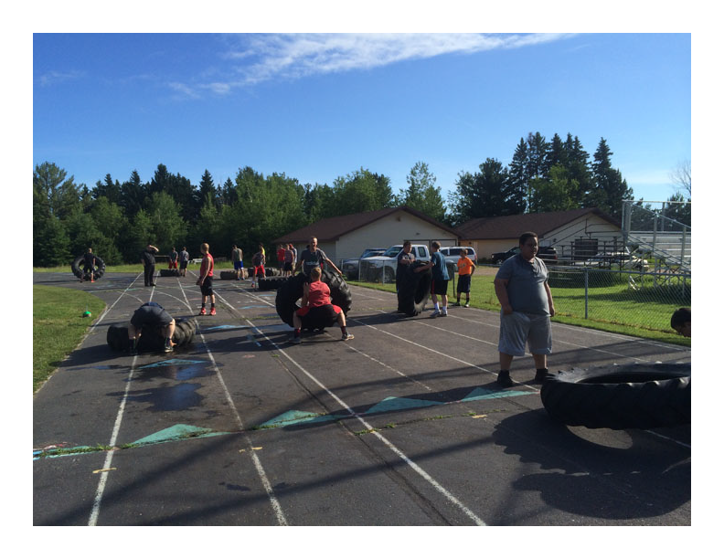

In order to compete in the Marawood Conference, it’s all about working hard and getting better.

The Hawks football team is getting better this summer in a variety of ways. Summer strength and conditioning is off and running each morning at the high schools. The first contact day of the summer will be this Wednesday, June 24th at Rib Lake from 4 pm - 7 pm with bowling at Little Bohemia to follow! This is a great opportunity for players to get introduced to new schemes, focus on fundamentals, and experiment with positions. Show up Wednesday with shorts, shoes, cleats and a water bottle ready to dig in!

Summer Schedule:

Contact days:

Wednesday, June 24th - 4 pm - 7 pm @ Rib Lake

Thursday, June 25th - 9 am - Noon @ Rib Lake

Wednesday, July 15th - 4pm - 7 pm @ Prentice

Golf Outing:

Saturday, August 1st - Noon @ Prentice Pines