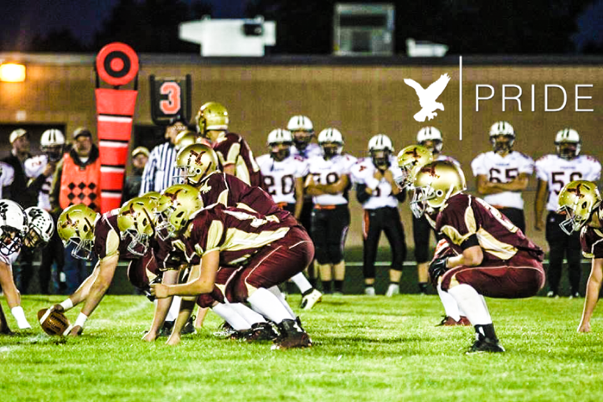
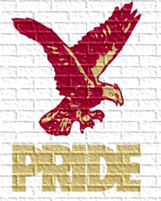

The identity of the RLP football team can be summed up in two words, **Hawks Pride**. To explain what Hawks Pride means, the team developed 3 core standards we strive to follow each and every day.  These are standards that can be followed during practice, while competing on gameday, and throughout your life:

# - No Excuses, No Explanations

# - 4-6, Snap to Whistle

# - ONE

Each player is asked to know and understand these standards, while living by them each day.

**“Hawks Pride”** is not only about what players do on the field, but how they represent the team off the field.

