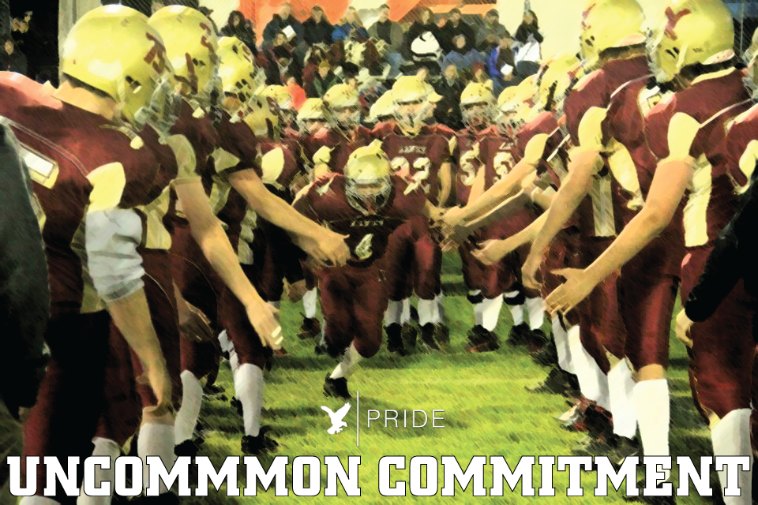
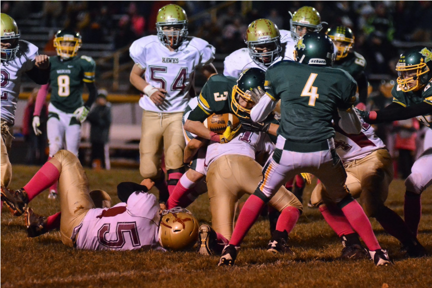

“There is no more powerful force than a group of men who share an uncommon commitment to each other and to achieving their mission.” -Urban Meyer

In order to compete in the Marawood Conference, we need an UNCOMMON COMMITMENT by all players and coaches. With this type of commitment, we will build an intentional culture in which our entire team is aligned and focused on our identity. Our goal is to be a team who gives maximum effort and plays with selfless commitment to the team.

We can do this by demonstrating Hawks Pride in everything we do, living “above the line,” and following our 3 core standards.

By doing these things, and working hard to improve everyday, holding ourselves and our teammates accountable, we will have success. It’s about US!

